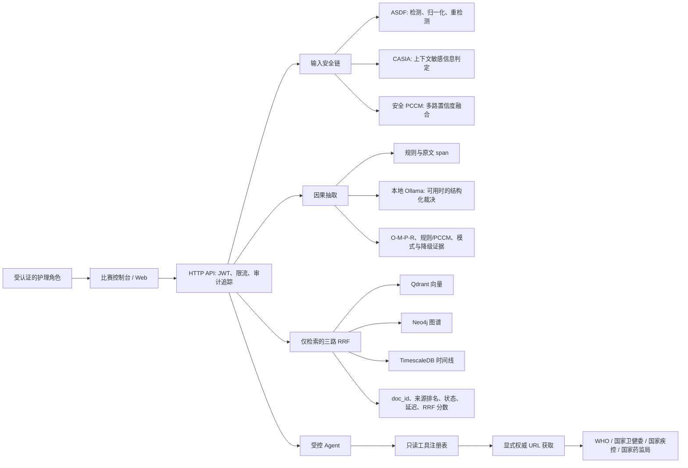

# 比赛架构与可信演示手册

> **比赛主线：智慧养老护理数据的对抗式隐私识别与可验证记忆治理平台。**
>
> 本文是比赛现场的运行与陈述口径。它只描述仓库中可定位的实现和可复跑的验证步骤；定量结论只能引用通过 [对比实验报告](对比实验报告.md) 门禁后生成的运行产物。

## 1. 问题和边界

护理记录涉及健康状况、用药、生活照护与家属沟通。系统解决的是这些数据进入智能处理链路后的四个安全问题：敏感信息及其变形绕过、跨来源检索缺乏证据、护理文本难以审计、以及隔离范围内的数据删除难以验证。

系统只提供护理人员的辅助整理、检索、摘要和风险提示，**不替代护工、医生或机构管理者**。任何风险提示都必须由有权限的人员复核；系统不会自动写入护理记录、发送通知、改变权限或执行删除。

比赛数据仅应使用合成数据或不可逆去标识数据。不得把护理原文、姓名、联系方式、证件号码、令牌或生产配置提交到公开仓库、演示报告或外部检索服务。

## 2. 可核验架构



### 安全识别链

- **ASDF**（Adversarial Sample Defense Framework）负责识别常见混淆形式，并执行“检测 - 归一化 - 重检测”。它的作用是让被空格、符号、中文数字或编码分割的敏感模式仍能进入后续检测，不把普通输入一律当作攻击。
- **CASIA**（Context-Aware Sensitive Information Algorithm）结合周边语义区分格式相似但含义不同的值，例如证件片段与邮政编码。响应中的命中层和配置用于审计，而非由日志反推结论。
- **PCCM**（Progressive Confidence Cumulation Model）融合多层检测或因果抽取的可见证据分量。安全识别 PCCM 与因果置信度 PCCM 是不同的处理位置，不能把其中一个的分数当作另一个任务的准确率。

安全接口返回实际层状态、检测层和回退信息。若多层路径故障，响应必须说明单层回退；现场不应将回退表现说成完整多层链路。

### 因果证据链

`POST /api/v1/causal/extract` 提供护理文本的 O-M-P-R（对象、介导因素、属性、结果）关系及原文证据。规则层优先生成可定位的候选；本地 Ollama 可用时才参与结构化裁决。响应携带规则命中、PCCM 分量、执行模式、模型状态、质量检查和持久化状态。

因果分析默认不写入图谱。只有请求明确设置 `persist=true` 并且后端确认成功时才可能写入；写入失败必须如实返回。模型不可用、超时或证据不足时，界面应明确显示规则模式、回退或“真实模型不可用”，不能补造完整关系或高置信度结论。

### 三路检索和 RRF 证据链

比赛检索使用受保护的 `POST /api/mcp/tools/retrieve_context`，并设置 `evaluationRetrievalOnly=true`。该模式禁止普通 LLM 回答掩盖检索来源。运行时适配器从 Qdrant、Neo4j、TimescaleDB 召回候选，仅对唯一 `doc_id` 进行 RRF 融合。

每个检索响应的 `retrieval_metadata` 是演示和评测唯一读取的审计契约，至少包括：

- `retrieval_fusion_mode`，例如三路 RRF 或明确降级模式；
- `source_statuses`、各来源排名和单路延迟；
- `wall_clock_latency_ms`；
- 结果的唯一 `doc_id`、来源和 RRF 分数。

任一路为空、超时或失败时，必须显示二路或向量回退，不能称为三路融合。`internal/engines/multi_dimensional_retrieval/engine.go` 是已弃用的原型；HTTP 主链路不使用它。

### 受控 Agent 和权威资料获取

比赛 Agent 入口为受 JWT 保护的 `POST /api/v1/agent/execute`。其工具注册表只允许：记忆检索、只读数据管理、自动摘要和权威资料获取（内部工具名 `authoritative_web_search`）。输出是待人工复核的草稿，并返回 `trace_id`、安全执行摘要、`write_applied=false` 与执行模式；不会回传思维链、工具参数或原始观察内容。

权威资料工具不是通用联网搜索：调用者必须提供文章的显式 HTTPS URL，且域名只允许 `who.int`、`nhc.gov.cn`、`chinacdc.cn`、`nmpa.gov.cn`。它阻止携带常见个人信息的查询或 URL 参数，校验跳转目标，并返回来源域名、获取时间、内容哈希和摘要。未提供合规 URL、来源不可达或内容不合规则应返回受控状态，不能改用通用搜索引擎，也不能把护理记录发往外网。

## 3. 真实运行与离线夹具

| 模式 | 用途 | 可展示内容 | 不能声称的内容 |
| --- | --- | --- | --- |
| `fixture` | 无服务、无模型的界面彩排 | 固定样例、交互流程、控制台状态文案 | 实时模型、真实 RRF 证据、安全或因果指标 |
| `ollama` / 实时 | 本地 Docker 服务、认证和本地 Ollama 都可用时的现场验证 | 受保护 API 的实际响应、来源状态、模型/规则状态、审计字段 | 未通过正式评测门禁的准确率、提升率或泛化结论 |

离线夹具必须醒目标为 `offline_fixture`。它不调用服务、数据库、模型、认证或删除接口，因此不能作为算法或性能结果。实时模式失败时应保留错误和降级状态，切换到夹具只能用于继续讲解流程。

用户删除演示准确称为“隔离用户的 Qdrant/副本向量删除验证”。它需要独立评测用户，并同时满足脚本开关和环境确认；它不是梯度投影式模型遗忘，也不证明训练参数已被遗忘。

## 4. 现场演示顺序

1. 在比赛机执行 `docker compose ps`，确认应用、Qdrant、TimescaleDB、Neo4j 均健康；确认本地 Ollama 已安装预定模型。
2. 使用演示环境变量登录并启动实时演示。脚本先检查健康、认证、模型、检索审计与安全接口，再写出本次运行目录和脱敏 JSON 清单：

   ```powershell
   $env:EVAL_USER_ID = 'eval_user_001'
   $env:EVAL_PASSWORD = '<仅本机环境变量>'
   powershell -File experiments/scripts/run_competition_demo.ps1 -Mode ollama -OpenConsole
   ```

3. 在控制台完成一次因果分析：展示 O-M-P-R 原文证据、执行模式、规则/模型状态和是否实际持久化。
4. 通过 `evaluationRetrievalOnly=true` 完成一次检索：展示结果的 `doc_id`、三路来源状态、排名、RRF 分数和延迟。若某源未就绪，说明实际降级。
5. 输入一条合成的对抗式敏感模式，展示 ASDF、CASIA、PCCM 的实际层证据与决策，不朗读或保存真实个人信息。
6. 可选地执行隔离用户删除验证。只在已重新种入隔离评测数据且 `EVAL_DEMO_ALLOW_UNLEARNING=true` 时启用；展示删除前后计数和检索探针。
7. 如实时环境不可用，改为 `-Mode fixture` 展示界面流程，并明确说明这不是实时实验。

赛前先运行同一脚本和正式评测，携带生成的报告、原始 JSON、数据集哈希和配置指纹。不要为了现场速度重跑长评测，也不要用 PPT 的旧数字替代本次运行证据。

## 5. 发布与评测门禁

下列 Linux Docker 门禁是发布或提交前的要求，不应因为 Windows 本地缓存或 Docker Desktop 不可用而省略：

```powershell
go mod verify
go vet -tags http ./...
go test -tags http ./...
python -m unittest discover -s experiments/scripts -p "test_*.py"
docker compose build
docker compose up -d
python experiments/scripts/smoke_test.py --mode live
```

正式 RRF 对比还必须在同数据集、同配置、同清理流程下分别运行完整系统、向量基线和过滤基线。报告需要保留数据集哈希、配置指纹、来源审计、清理记录、失败或降级状态。任一门禁未通过时，报告只能登记“待门禁”，不得输出准确率、召回率、提升率或延迟结论。

提交 Git 前运行与改动对应的测试并创建独立提交。公开快照前检查 `.env`、令牌、运行密钥、`effective.env` 和私有实验数据均未被纳入版本控制。

## 6. 答辩的一句话

> 我们不是让 AI 替代护理人员，而是把护理数据进入智能系统后的隐私识别、证据检索、因果整理、受控辅助与删除验证做成可运行、可审计、可复验的安全治理链路。
